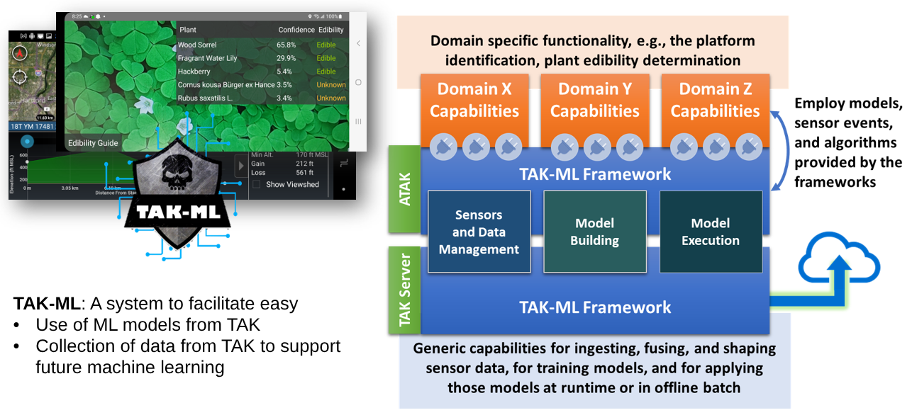
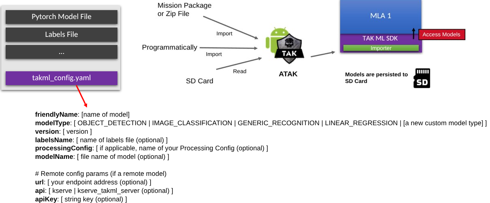
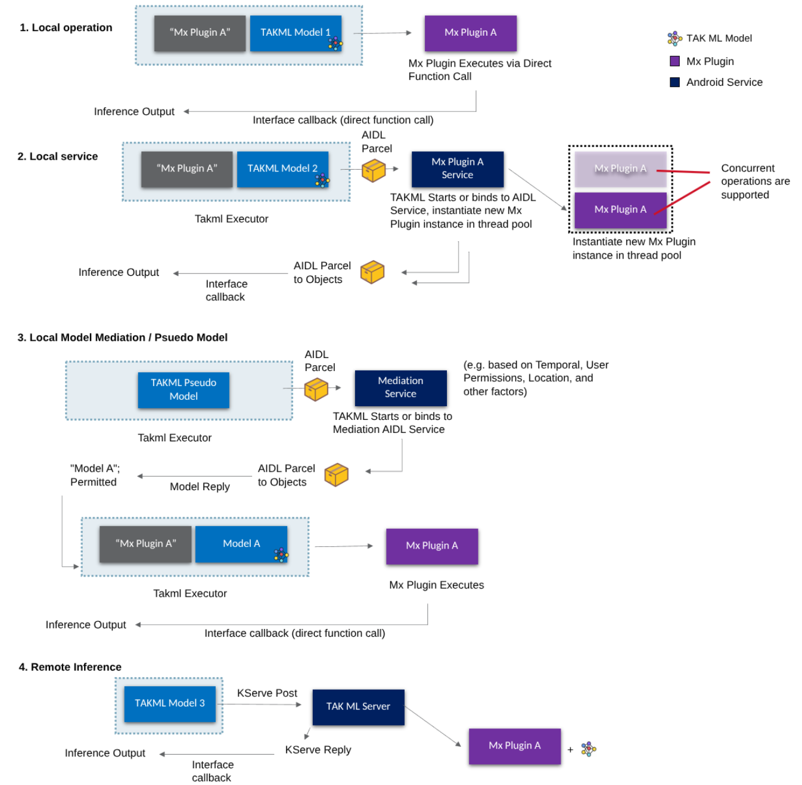
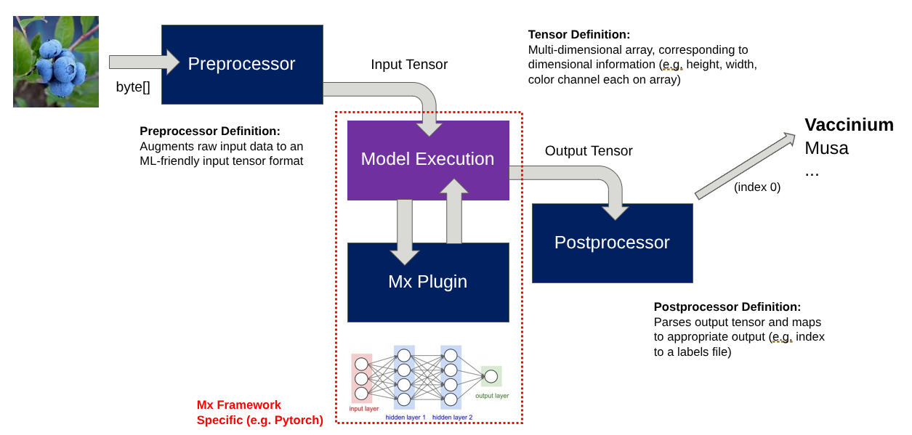
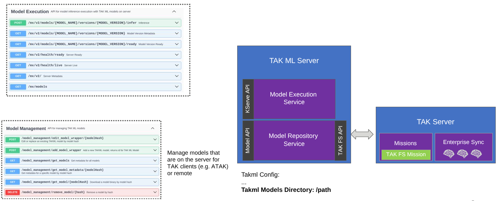

### TAK ML (Team Awareness Kit Machine Learning)

TAK ML (Team Awareness Kit Machine Learning) is a toolkit for TAK/ATAK that enables machine learning model packaging, storage, distribution, and execution in operational environments. It supports on-device (edge) inference in ATAK and an optional server component for remote execution and model repository capabilities. TAK ML is designed to be device-agnostic and runtime-pluggable via Model Execution Plugins, supporting common frameworks such as PyTorch, ExecuTorch, TensorFlow/TFLite, and ONNX, with KServe-compatible inference APIs for remote execution with a compatible TAK ML Server or KServe back-end.

### Prerequisites
* GIT LFS (https://git-lfs.com/)
* JDK 21 (TAK ML Server), JDK 17+ and Android Studio (TAK ML Android)
* Tested in Linux and MacOS development environments

### Components
#### 1. Model Execution / Model Management Framework 
* Local (End User Device) Model Execution: see `takml-atak`
* Remote Model Execution: see `takml-server`
#### 2. Sensor Framework
* Public Release Coming soon



** Note, at the time of this writing, #1 is the only updated component in this repo. 
 
Compatible with ATAK Civ 5.4/5.5 and TAK Server 5.4/5.5

### Core Concepts
#### TAK ML Model Wrapper
The TAK ML Model Wrapper provides the full representation of a machine learning model along with any associated metadata. This zip-based wrapper can be ingested into TAK ML at run-time through local storage, mission packages, from the remote TAK ML Server repository, or programmatically -- supporting flexibility in real-time operations.

<figure>
  
  <figcaption><i>TAK ML Architecture Overview</i></figcaption>
</figure>

See [`./takml-atak/TAK ML MLA Plugin Development.docx`](./takml-atak/TAK%20ML%20MLA%20Import%20TAKML%20Model.docx) for more info on importing models.

TAK ML Model Wrappers can be statically defined, as illustrated above, but also programmatically instantiated using Java's Builder pattern. Examples are provided below:

```
TakmlModel localModel =
    new TakmlModel.TakmlModelBuilder(
        "Vehicle Detector",
        Uri.fromFile(new File("/sdcard/models/vehicle.tflite")),
        "tflite",
        "object-detection"
    )
    .setVersionNumber(1.2)
    .setLabels(List.of("car", "truck", "tank"))
    .build();
```
```
TakmlModel remoteModel =
    new TakmlModel.TakmlRemoteModelBuilder(
        "Cloud Classifier",
        "image-classification",
        tensorProcessor,
        "https://api.example.com/infer"
    )
    .setApiKey("Authorization", "Bearer TOKEN")
    .build();
```

They are then executable via a **Takml Executor**. 

#### TAK ML Executor

The Takml Executor intelligently maps a given TAK ML Model to a respective Model Execution Plugin, and supports specifying how the model should be run. This supports running the model directly or in a delegated Android Service. Android Services are instantiated per Mx Plugin, each with own thread pool handling mx requests. 

```
TakmlExecutor executor = new TakmlExecutor(runAsService,takmlModel);
executor.executePrediction(imageBytes, (results, success, model, type) -> {
    if (success) {
        // handle TakmlResult
    }
});
```

<figure>
  
  <figcaption><i>TAK ML Executor Pipeline</i></figcaption>
</figure>

See [`./takml-atak/TAK ML MLA Plugin Development.docx`](./takml-atak/TAK%20ML%20MLA%20Plugin%20Development.docx) for more info on usage.

#### Model Execution Plugins
The TAK ML Model Execution framework is modularly defined and eases the startup and maintability cost of integrating models at the edge. Both the remote TAK ML Server and the end user clients (ATAK) provide an extensible model execution plugin capability. All of the major machine learning execution frameworks are supported (PyTorch, TensorFlow, etc.) along with their mobile optimized counterparts (TorchScript, TFLite, etc.) through Model Execution plugins (Mx Plugins). Developers are able to extend existing Mx Plugins to add additional functionality, or create their own Mx plugins. 

<figure>
  
  <figcaption><i>Model Execution in TAK ML</i></figcaption>
</figure>

See [`./takml-atak/TAK ML MLA Plugin Development.docx`](./takml-atak/TAK%20ML%20Mx%20Plugin%20Development.docx) for more info on implementation.

#### Tensor Processor
Preprocessing and Postprocessing constructs are easily definable in neural network configurations, these provide model-specific configuration on how the input tensors should be transformed for the model and how the output tensors of the model should be transformed to a mapped and semantically understandable result (e.g. label). 


#### TAK ML Server

While TAK ML can run entirely locally on an ATAK device, there is also an optional server component that integrates with TAK Server to provide remote model execution along with a model repository. These are accessible directly in ATAK programmatically or via the API's illustrated below (model execution implements the KServe API).



### Additional Information

While TAK ML is a polished product, it continues to evolve and improve over time. We welcome any suggestions, pull requests, and all the good that comes from open sourcing this technology. 

For questions and any support, please reach out to:
```
Nate Soule: Program Lead
nathaniel.soule@rtx.com
```
```
Brandon Kalashian: Mx/Model Repository Lead Developer
brandon.kalashian@rtx.com
```
