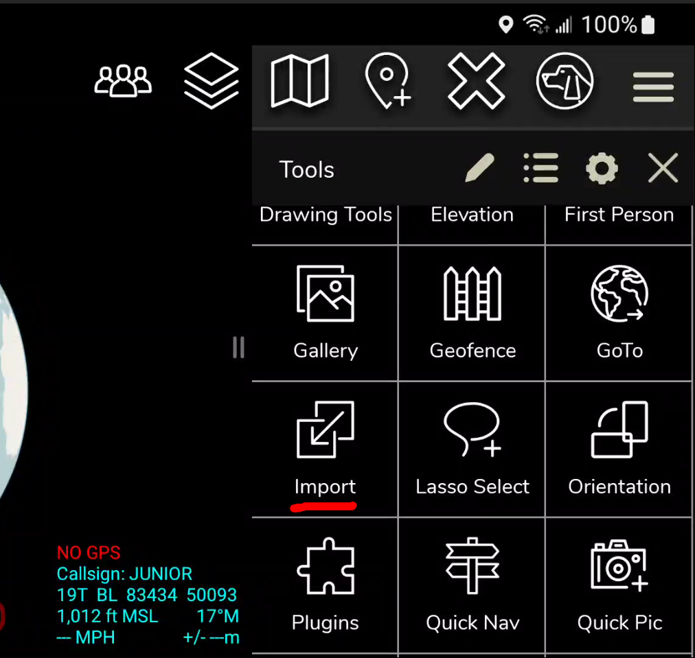
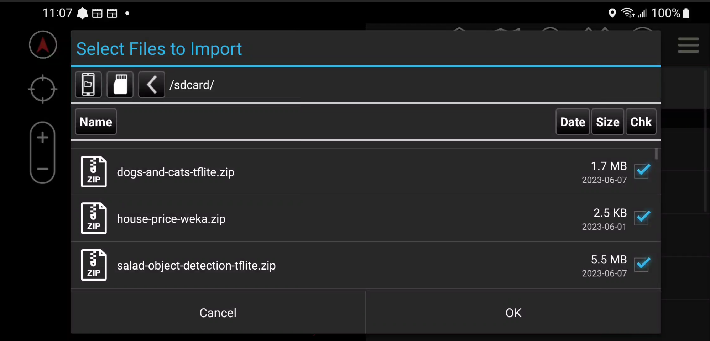

TAKML MLA Example Weka ATAK Plugin. Please make sure to install Git LFS prior to cloning.

_________________________________________________________________
PURPOSE AND CAPABILITIES

Demonstrates Image Classification and Object Detection with Pytorch and TFLite with TAK ML. Contains
4 models:
1. Dogs and Cats Pytorch (Image Classification)
2. Dogs and Cats TFLite (Image Classification)
3. Visdrone Pytorch (Object Detection)
4. Salad TFlite (Object Detection)
_________________________________________________________________
POINT OF CONTACTS

Brandon Kalashian - brandon.kalashian@rtx.com  
Nate Soule - nathaniel.soule@rtx.com

_________________________________________________________________
DEVELOPER NOTES

This project illustrates two methods of importing ML models:  
1. Programmatically / embedded in apk. The Dogs and Cats Pytorch model is imported this way in the code.
2. Via ATAK's import utility. The other 3 models are imported this way (see below)

There are two steps for using this plugin:
1. Install the plugin (e.g. ./gradlew clean installCivDebug)
2. Import the two model zip files via ATAK import utility
3. Copy model zip files to your Android device:
   ```
   adb push dogs-and-cats-tflite.zip /sdcard   
   adb push visdrone-object-detection.zip /sdcard   
   adb push salad-object-detection-tflite.zip /sdcard
   ```
4. Import model files via ATAK  
   Open ATAK Import Utility    
       
   Next, Select 'Local SD'  
      
   Next, select the TAK ML Model zip files and click OK to import  
      
   Finally, after a handful of seconds (sometimes several), the TAK ML Models will import. You should see a notification for each model imported (like below):  
    
