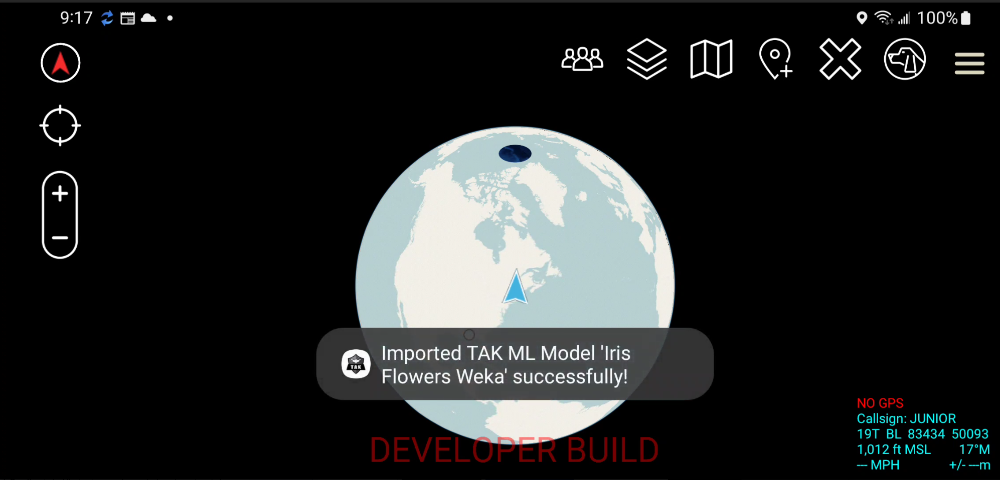

TAKML MLA Example Weka ATAK Plugin. Please install Git LFS prior to cloning. 

_________________________________________________________________
PURPOSE AND CAPABILITIES

Demonstrates Classification using a Iris Flowers classification model and Linear Regression with a house price estimation model.   

_________________________________________________________________
POINT OF CONTACTS

Brandon Kalashian - brandon.kalashian@rtx.com  
Nate Soule - nathaniel.soule@rtx.com

_________________________________________________________________
DEVELOPER NOTES

This project illustrates two methods of importing ML models:  
1. Programmatically / embedded in apk. The Iris Flowers model is imported this way in the code.
2. Via ATAK's import utility. The House Price Model is imported this way (steps below)

There are two steps for using this plugin:
1. Install the plugin (e.g. ./gradlew clean installCivDebug)
2. Import the house price model via ATAK import utility
3. Copy model zip files to your Android device:    
	```
	adb push house-price-weka.zip /sdcard
	```
4. Import model files via ATAK  
	Open ATAK Import Utility    
	    
	  Next, Select 'Local SD'  
	     
	  Next, select the House Price Model zip file and click OK to import  
	     
	  Finally, after a handful of seconds (sometimes several), the TAK ML Models will import. You should see a notification for model imported like below:  
	   
